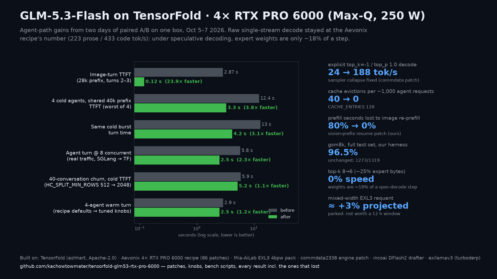

# GLM-5.3-Flash on TensorFold, 4× RTX PRO 6000: the agent-path overlay

Two custom TensorFold patches, a tuned knob file, the measurement scripts, and every result (including the ones that lost) from two days of paired A/B on one box: 4× NVIDIA RTX PRO 6000 Blackwell Max-Q (96 GB each, PCIe, 250 W cap), TensorFold v0.6.5 with the Aevonix 86-patch recipe, Mia-AiLab's EXL3 4-bpw pack, the DFlash2 drafter.



This overlay does **not** make single-stream decode faster. It stays at the Aevonix recipe's number (223 tok/s prose, 433 code, greedy, server-side). What it changes is what coding agents feel: cold bursts, image turns, cache behaviour, and the sampler edge case that collapsed throughput. The reason raw decode is where it is: under speculative decoding each MoE layer touches ~60 distinct experts per step no matter what you do to the weights, so expert bytes are ~18% of a step; we measured that by cutting them 25% (top-k 8 → 6) and getting 0%. Details in [docs/RETROSPECTIVE.md](docs/RETROSPECTIVE.md).

## What is in here

| path | what | status |
|---|---|---|
| `patches/0910-vision-prefix-resume.patch` | image prompts keep and resume their text prefix in the kept-state cache instead of re-prefilling the whole conversation every turn. 3-turn image conversation, 28k prefix: turn-2/3 TTFT **2.87 s → 0.12 s** (27,968 of 28,058 tokens cached), replies and greedy probes identical. Flag `TF_GLM_VISION_PREFIX=1`. | in production |
| `patches/0909-mixed-bits.patch` | lets TF load EXL3 packs whose routed experts have different bit widths per tensor (3/4/5) and makes the autotuner tune every width present. On a normal 4-bit pack it is a verified no-op (probes and tok/s identical). Needed only if you requantize with exllamav3's per-tensor recipe. | verified, idle |
| `patches/variants/0910-…x1.patch` | the same vision-prefix patch for trees that also carry commdata2338's engine patch (see PINS.md) | in production on our box |
| `scripts/local.sh` | the tuned knobs with the measurement that justified each one (see below) | in production |
| `scripts/install-overlay.sh` | puts the patches and knobs onto a clean Aevonix recipe checkout | tested on a clean checkout |
| `bench/` | `tfprobe2.py` (4 fixed greedy probes, server-side tok/s + accepted/drafted), `quietprobe.sh` (runs them only when the server is idle), `agentsim.py` (4 agents × 6 turns on ~58k-token repos + 40-conversation churn), `cjk_canary.py` (20 Chinese prompts, counts U+FFFD), `visionprobe.py` (3-turn image conversation) | what every number here was measured with |
| `results/` | `baseline-x9-2026-10-07.json` (the full measured baseline with every command), the graphic and its script | |
| `rejected/` | four patches of ours that lost, with their numbers | kept on purpose |
| `docs/` | the retrospective and the dry-run window log | |
| `PINS.md` | every upstream this sits on, with sha and licence | |

## The knobs (`scripts/local.sh`), each with the paired measurement

| knob | value | measured (same box, same prompts, paired against the recipe default) |
|---|---|---|
| `TF_GLM_MULTI_WINDOW` / `TF_GLM_MULTI_GRAPH_STEP` | 64 / 4 | with the three below: 4-agent warm turn 2.9 → 2.7 s, TTFT p90 0.98 → 0.52 s, churn cold turn 12.2 → 8.6 s |
| `TF_GLM_PREFILL_ROWS` + `TF_GLM_CE_ARENA_MIB` | 8192 + 320 | prefill chunks of 8192 rows (autotune the 4097–8192 bucket: 11 shapes +8.6…+23.5%) |
| `TF_GLM_FILL_ROWS` | 4096 | part of the same round |
| `TF_GLM_CACHE_ENTRIES` | 128 | 4-agent warm turn 2.5 s / p90 3.5, churn warm turn 5.8 → 3.1 s; at 128: 0 evictions in 1,077 agent requests vs 40 before |
| `TF_GLM_HC_SPLIT_MIN_ROWS` | 2048 (default 512) | small warm-turn fills (~1k rows) skip the 4-rank hyper-connection split: churn cold TTFT 5.9 → 5.2 s, consistent on every cell across two runs, probes identical |
| `TF_GLM_VISION_PREFIX` | 1 | needs patch 0910; numbers above |
| `TENSORFOLD_GPU_SAMPLE_FULL`, `TENSORFOLD_SAMPLE_SKIP_FUTILE`, `TF_GLM_BURST_PREFIX`, `TF_GLM_CACHE_REASONS` | 1 | **only with commdata2338's engine patch** (optional, see PINS.md): explicit `top_k=-1` / `top_p 1.0` decode 24 → 188 tok/s; 4 cold agents sharing a 40k prefix: TTFT 6.3–12.4 s → 3.3 s each, turn ~13 s → 4.2 s. Without that patch these variables are ignored |

Power cap stays at 250 W (settled earlier: 400 W made decode slightly worse on these cards).

## Setup (one evening, assuming the hardware)

Hardware: 4× RTX PRO 6000 Blackwell (96 GB each; ours are Max-Q), PCIe host with CUDA peer access between every pair (`nvidia-smi topo -p2p r` all OK), ~400 GB of free disk for the pack, Docker with the NVIDIA runtime. Everything runs inside the recipe's container.

```bash
# 1. the Aevonix recipe at the pinned commit
git clone https://github.com/Aevonix/GLM-5.3-Flash-EXL3-4x-RTX-PRO-6000-TensorFold recipe
cd recipe && git checkout a19078566298f8c51d9dbb317f20efd51fe564df && cd ..

# 2. this overlay onto it (copies patches into patches/extra/, fixes the strict patch count, installs the knobs)
git clone https://github.com/kachowtowmater/tensorfold-glm53-rtx-pro-6000 overlay
./overlay/scripts/install-overlay.sh "$PWD/recipe"

# 3. build the image: clones TensorFold v0.6.5, applies 86 + 2 patches, installs the runtime (first build ~20-40 min)
cd recipe && ./scripts/prepare.sh        # downloads Mia's pack (164 GB) + DFlash2 if missing; DRY_RUN=1 ./scripts/prepare.sh to see the plan

# 4. serve (first start compiles the CUDA kernels and autotunes, ~10 min; cached afterwards)
./start.sh                                # model id glm-5.3-flash-rtx on :8090 (PORT= and SERVED_NAME= in scripts/local.sh)
curl -s localhost:8090/v1/models

# 5. measure what you got (server-side numbers come from the TF log, not the client)
PORT=8090 LOG=$PWD/logs/current/rank0.log ../overlay/bench/quietprobe.sh      # 4 probes: tok/s + accepted/drafted
python3 ../overlay/bench/agentsim.py 4 6 30000 40                               # 4 agents x 6 turns + 40-conversation churn
python3 ../overlay/bench/cjk_canary.py                                          # expect 0 mid-text U+FFFD
./stop.sh
```

Expected on our box after step 5: probes `222/330 329/392 310/367 242/424` accepted/drafted at `223 / 433 / 383 / 235` tok/s; agentsim 4-agent warm turn ~2.9 s (p90 3.8), churn warm turn ~5.5 s; agentsim cells repeat within ±10–15%, probes within ±2%. Full baseline: `results/baseline-x9-2026-10-07.json`.

Optional, for the sampler fix and burst-prefix sharing: fetch commdata2338's engine patch (PINS.md), drop it in `recipe/patches/extra/0900-commdata-engine.patch`, replace `0910-…` with `patches/variants/0910-…x1.patch`, rerun `install-overlay.sh` (it recounts), rebuild. We run that in production; we do not redistribute their patch because it carries no licence.

## What did not work (short version; numbers in `rejected/README.md`)

Decode-wait yields, PDL on the EXL3 decode kernel, two mixed chunk+decode schedulers, Mia's sliced fill, CUDA-IPC comms, deeper or cost-measured draft depth, bf16 KV, bigger prefill rows, more parallel streams. Top-k 8 → 6 kept quality (gsm8k 96.0 vs 95.7 on a paired 300-item subset) and changed speed 0%, which is the measurement that tells you expert bytes are not the bottleneck under speculative decoding and parked our requant plan. What we did not get to: a step-time breakdown of the other ~82% (TP4 all-reduce over PCIe and ungraphed 9-token verify steps are the suspects). If you do it first, open an issue.

## Credits

- **TensorFold** by [ashhart](https://github.com/ashhart/TensorFold) (Apache-2.0): the engine, EXL3 expert kernels, DSA/KDA attention, CUDA graphs, drafter verification. Everything here is a patch on top of it.
- **Aevonix**: the [4× RTX PRO 6000 recipe](https://github.com/Aevonix/GLM-5.3-Flash-EXL3-4x-RTX-PRO-6000-TensorFold) (TP4, FP8 KV, 1M window, 86 patches with Mia-AiLab) and the published baseline we measured against.
- **Mia-AiLab**: the EXL3 4-bpw pack and the original DGX Spark patch series.
- **commdata2338**: the engine patch that fixes the sampler collapse and adds burst-prefix sharing and cache-reason logging, plus the independent 4× PRO 6000 benchmark.
- **incoai**: the DFlash2 drafter weights. **turboderp**: exllamav3 and the EXL3 format.
- Measured and written by kachowtowmater's agent fleet (Claude Code orchestrating omp/GLM workers), Oct 5–7 2026.

Licence: Apache-2.0 for the files in this repo (patches are derivatives of TensorFold, same licence). Weights and upstream patches are not included; see PINS.md.
